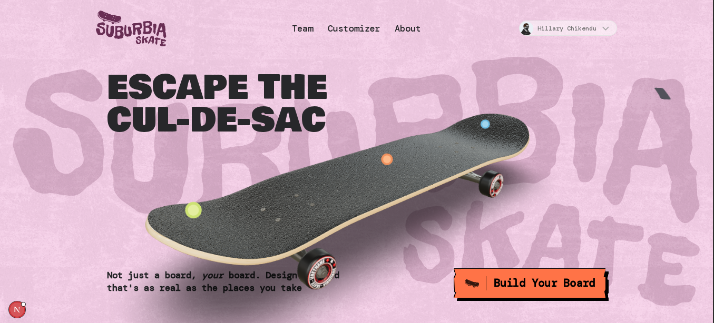

# Suburbia Skateboard Customizer



A modern web application for customizing skateboards and minting them as NFTs on the Solana blockchain. Built with Next.js, featuring 3D visualization, real-time customization, and seamless NFT creation.


## 🌟 Features

- **3D Skateboard Customization**: Interactive 3D skateboard builder with real-time preview
- **NFT Minting**: Mint custom skateboards as NFTs on Solana blockchain
- **User Authentication**: Secure authentication via Civic
- **Profile Management**: View created and owned NFTs
- **Responsive Design**: Optimized for desktop and mobile devices
- **CMS Integration**: Content management with Prismic
- **Asset Storage**: GitHub-based asset storage for NFT metadata
- **Real-time Updates**: Live customization with instant visual feedback

## 🛠️ Tech Stack

### Frontend

- **Next.js 15** - React framework with App Router
- **React 19** - UI library
- **TypeScript** - Type-safe JavaScript
- **Tailwind CSS** - Utility-first CSS framework
- **Three.js** - 3D graphics and visualization
- **React Three Fiber** - React renderer for Three.js
- **GSAP** - Animation library

### Backend & Database

- **Convex** - Real-time backend-as-a-service
- **Prismic** - Headless CMS for content management

### Blockchain

- **Solana Web3.js** - Solana blockchain interaction
- **Metaplex SDK** - NFT creation and management
- **Civic Auth** - Decentralized identity and wallet management

### Storage & APIs

- **NFT.Storage** - Decentralized storage for NFT assets
- **GitHub API** - Asset storage and hosting
- **Octokit** - GitHub API client

## 📋 Prerequisites

Before running this application, make sure you have the following installed:

- **Node.js** (v18 or higher)
- **npm** or **yarn** or **pnpm**
- **Git**

## 🚀 Installation

1. **Clone the repository**

   ```bash
   git clone https://github.com/your-username/suburbia-sb.git
   cd suburbia-sb
   ```

2. **Install dependencies**

   ```bash
   npm install
   # or
   yarn install
   # or
   pnpm install
   ```

3. **Set up environment variables**

   Create a `.env.local` file in the root directory and add the following variables:

   ```env
   # Convex
   NEXT_PUBLIC_CONVEX_URL=your_convex_url

   # Civic Auth
   NEXT_PUBLIC_CIVIC_APP_ID=your_civic_app_id

   # NFT.Storage
   NFT_STORAGE_KEY=your_nft_storage_key

   # GitHub (for asset storage)
   GITHUB_TOKEN=your_github_personal_access_token

   # GitHub Repository Details
   GITHUB_OWNER=your_github_username
   GITHUB_REPO=your_asset_repository_name
   ```

4. **Set up Convex**

   ```bash
   npx convex dev --once
   ```

5. **Set up Prismic**
   - Create a Prismic account and repository
   - Configure the custom types in the `customtypes/` directory
   - Update your Prismic API endpoint in `src/prismicio.ts`

6. **Run the development server**

   ```bash
   npm run dev
   # or
   yarn dev
   # or
   pnpm dev
   ```

   Open [http://localhost:3000](http://localhost:3000) with your browser to see the application.

## 🔧 Configuration

### Environment Variables

| Variable                   | Description                  | Required |
| -------------------------- | ---------------------------- | -------- |
| `NEXT_PUBLIC_CONVEX_URL`   | Convex deployment URL        | Yes      |
| `NEXT_PUBLIC_CIVIC_APP_ID` | Civic application ID         | Yes      |
| `NFT_STORAGE_KEY`          | NFT.Storage API key          | Yes      |
| `GITHUB_TOKEN`             | GitHub personal access token | Yes      |
| `GITHUB_OWNER`             | GitHub repository owner      | Yes      |
| `GITHUB_REPO`              | GitHub repository name       | Yes      |

### Prismic Setup

1. Install Prismic CLI:

   ```bash
   npm install -g prismic-cli
   ```

2. Login to Prismic:

   ```bash
   prismic login
   ```

3. Push custom types:
   ```bash
   prismic push --custom-types
   ```

## 📖 Usage

### Building a Skateboard

1. **Navigate to the Builder**: Go to `/build` to access the skateboard customizer
2. **Customize Components**:
   - **Wheels**: Choose from different wheel designs and colors
   - **Deck**: Select deck graphics and materials
   - **Truck**: Pick truck styles and finishes
   - **Bolts**: Customize bolt colors and materials
3. **Preview**: See real-time 3D preview of your skateboard
4. **Connect Wallet**: Link your Solana wallet for NFT minting

### Minting NFTs

1. **Authenticate**: Sign in with Civic authentication
2. **Create Wallet**: Generate a Solana wallet if you don't have one
3. **Customize**: Build your perfect skateboard
4. **Mint**: Click "Mint as NFT" to create your NFT on Solana devnet
5. **View Profile**: Check your minted NFTs in the profile section

### Viewing Profiles

- Visit `/profile` to see your created and owned NFTs
- Browse all community-created skateboards
- View NFT details and transaction history

## 🏗️ Project Structure

```
suburbia-sb/
├── convex/                    # Convex backend functions
│   ├── _generated/           # Auto-generated Convex types
│   ├── nfts.ts              # NFT-related database operations
│   ├── schema.ts            # Database schema definition
│   └── users.ts             # User management functions
├── customtypes/              # Prismic custom types
├── public/                   # Static assets
│   ├── hdr/                 # HDRI environment maps
│   └── skateboard/          # 3D model textures
├── src/
│   ├── app/                 # Next.js app directory
│   │   ├── actions/         # Server actions
│   │   ├── api/             # API routes
│   │   ├── build/           # Skateboard builder pages
│   │   ├── profile/         # User profile pages
│   │   └── layout.tsx       # Root layout
│   ├── components/          # Reusable React components
│   ├── helpers/             # Utility functions
│   ├── lib/                 # Library configurations
│   ├── slices/              # Prismic slices
│   └── prismicio.ts         # Prismic client setup
├── package.json
├── tailwind.config.ts
├── next.config.ts
└── README.md
```

## 🔗 API Reference

### Convex Functions

#### NFTs

- `createNFT`: Create a new NFT record
- `getNFTByMint`: Get NFT by Solana mint address
- `getAllNFTs`: Retrieve all NFTs

#### Users

- `createUser`: Create a new user profile
- `getUserByWallet`: Get user by wallet address
- `getUserProfile`: Get complete user profile with NFTs

### Server Actions

#### GitHub Storage

- `uploadToGitHub`: Upload NFT assets to GitHub repository

#### NFT Minting

- `uploadToIpfs`: Upload metadata to IPFS via NFT.Storage

## 🎨 Customization Options

### Wheels

- Multiple design patterns
- Various colors and materials
- Size variations

### Decks

- Graphic designs
- Material finishes
- Size options

### Trucks

- Different styles
- Metal finishes
- Mounting options

### Bolts

- Color variations
- Material choices
- Size specifications

## 🔐 Authentication

The application uses Civic for decentralized authentication, providing:

- Secure wallet management
- Solana address integration
- User profile creation
- NFT ownership verification

## 🚀 Deployment

### Vercel Deployment

1. **Connect Repository**: Link your GitHub repository to Vercel
2. **Environment Variables**: Add all required environment variables
3. **Build Settings**: Configure build command and output directory
4. **Deploy**: Push to main branch to trigger deployment

### Convex Deployment

```bash
npx convex deploy
```

### Prismic Deployment

Content is automatically deployed through Prismic's CDN.

## 🤝 Contributing

1. Fork the repository
2. Create a feature branch: `git checkout -b feature/your-feature`
3. Commit changes: `git commit -am 'Add your feature'`
4. Push to branch: `git push origin feature/your-feature`
5. Submit a pull request

### Development Guidelines

- Use TypeScript for all new code
- Follow ESLint configuration
- Write meaningful commit messages
- Test on both desktop and mobile
- Ensure accessibility compliance

## 📄 License

This project is licensed under the MIT License - see the [LICENSE](LICENSE) file for details.

## 🙏 Acknowledgments

- **Three.js** community for 3D visualization
- **Solana** for blockchain infrastructure
- **Metaplex** for NFT tooling
- **Civic** for authentication solutions
- **Prismic** for content management
- **Convex** for backend services

## 📞 Support

For support and questions:

- Create an issue on GitHub
- Join our Discord community
- Check the documentation

---

Built with ❤️ for the skateboarding and NFT communities
